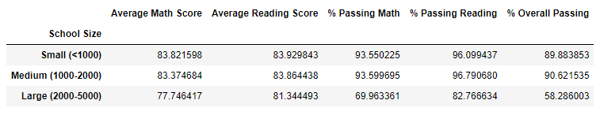
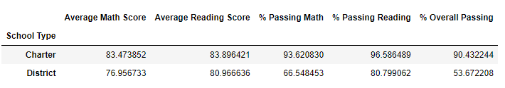
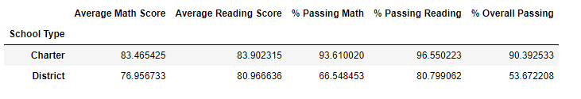

# School District Analysis
## Purpose
The school board found out there was academic dishonesty with the 9th graders at Thomas High School. They asked Maria for help and now she needs our help to clean up the bad data. We want to remove math and reading scores for 9th graders at Thomas High School with NaNs. Then we will repeat our analysis with the clean data.
## Results
- How is the district summary affected?\
Before:\
\
After:\
\
Above shows the district summaries of before and after the removal of Thomas High School’s 9th grader’ math and reading scores. We can see that the average math score, average reading score, % passing math, % passing reading, and % overall passing was all affected. All of them decreased a small amount after the removal of Thomas High School’s 9th grader’s math and reading scores.
- How is the school summary affected?\
Before removing Thomas High 9th graders' math and reading scores:\
\
Before removing Thomas High 9th graders from total students in Thomas High:\
\
After:\
\
Above shows Thomas High’s summary in three steps. First step shows what the summary looked like before removing Thomas High’s 9th graders’ math and reading scores. The next step shows after removing the 9th graders’ math and reading scores, but before removing the 9th graders from the total students in Thomas High.  We can see the average math score decreased and the average math score increased after the removal of the 9th graders’ math scores. The last step shows after the removal of Thomas High’s 9th graders from the total students in Thomas High. We can see that the % passing math, % passing reading, and % overall passing significantly increased. This result makes perfect sense. If we removed the math and reading scores of 9th graders, then we would also need to remove the 9th graders from the total number of students in order to show an accurate passing rate for math, reading, and overall.
- How does replacing the ninth grader's math and reading scores affect Thomas High School's performance relative to the other schools?
Before:\
\
After:\
\
Above shows the top 5 schools in performance, both before and after the removal of 9th graders from Thomas High School. We can see that either way Thomas High School is the second best in performance by their math and reading scores. Removing the 9th graders did not affect their performance compared to other schools.
- How does replacing the ninth-grade scores affect the following:
  - Math and reading scores by grade\
  Before Math:\
  \
  After Math:\
  \
  Before Reading:\
  \
  After Reading:\
  \
  Above shows the breakdown of average math and reading scores per grade, both before and after the removal of 9th graders from Thomas High School. As we can see, the only change is the removal of 9th graders from Thomas High School in each chart. Now let’s find if there was a change in average scores for 9th graders in the district after the removal of 9th graders from Thomas High School. The average math score decreased from 80.352 to 80.120 and the average reading score decreased from 82.513 to 82.426. 
  - Scores by school spending\
  Before:\
  \
  After:\
  \
  Above shows the scores by school spending, both before and after the removal of 9th graders from Thomas High School.  There are only changes in the spending range of $630-644, which is what range Thomas High School is in. The average math score, % passing math, % passing reading, and the % overall passing all decreased a bit. Whereas, the average reading score increased. 
  - Scores by school size
  Before:\
  \
  After:\
  \
  Above shows the scores by school size, both before and after the removal of 9th graders from Thomas High School.  There are only changes in the medium size range (1000-2000), which is what range Thomas High School is in. The average math score, % passing math, % passing reading, and the % overall passing all decreased a bit. Whereas, the average reading score increased.
  - Scores by school type
    Before:\
  \
  After:\
  \
  Above shows the scores by school type, both before and after the removal of 9th graders from Thomas High School.  There are only changes in the charter school type, which is what school type Thomas High School is. The average math score, % passing math, % passing reading, and the % overall passing all decreased a bit. Whereas, the average reading score increased.
## Summary
After removing 9th graders from Thomas High School, there were a few changes in the school district analysis. One change was the average math and reading scores in the district summary. The averages both decreased a small amount, which led to a decreased passing rate for both and a decreased overall passing rate. Another change was the average math and reading scores for Thomas High School. The averages decreased a little bit more than in the district summary. This led to a decreased passing rate for both and a decreased overall passing rate. However, before removing the number of 9th grade students from calculating the percentages, all the percentages were significantly lower. It was important to remove the 9th graders from the total students at Thomas High in order to get accurate percentages of passing math, passing reading, and overall passing. Another change was the average math score and average reading score of 9th graders in the district. After the removal of 9th graders from Thomas High School, the average math score decreased from 80.352 to 80.120 and the average reading score decreased from 82.513 to 82.426. The last major change was all the categories Thomas High School is in, the spending range of $630-644, a medium (1000-2000) sized school, and a charter school. In all of these categories, the average math score, % passing math, % passing reading, and the % overall passing all decreased. However, the average reading score increased.
