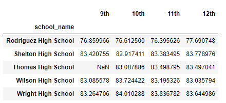

# School District Analysis
## Purpose
The school board found out there was academic dishonesty with the 9th graders at Thomas High School. They asked Maria for help and now she needs our help to clean up the bad data. We want to remove math and reading scores for 9th graders at Thomas High School with NaNs. Then we will repeat our analysis with the clean data.
## Results
- How is the district summary affected?\
Before:\
\
After:\
\
Above shows the district summaries of before and after the removal of Thomas High School’s 9th grader’ math and reading scores. We can see that the average math score, average reading score, % passing math, % passing reading, and % overall passing was all affected. All of them decreased a small amount after the removal of Thomas High School’s 9th grader’s math and reading scores.
- How is the school summary affected?\
Before removing Thomas High 9th graders' math and reading scores:\
\
Before removing Thomas High 9th graders from total students in Thomas High:\
\
After:\
\
Above shows Thomas High’s summary in three steps. First step shows what the summary looked like before removing Thomas High’s 9th graders’ math and reading scores. The next step shows after removing the 9th graders’ math and reading scores, but before removing the 9th graders from the total students in Thomas High.  We can see the average math score decreased and the average math score increased after the removal of the 9th graders’ math scores. The last step shows after the removal of Thomas High’s 9th graders from the total students in Thomas High. We can see that the % passing math, % passing reading, and % overall passing significantly increased. This result makes perfect sense. If we removed the math and reading scores of 9th graders, then we would also need to remove the 9th graders from the total number of students in order to show an accurate passing rate for math, reading, and overall.
- How does replacing the ninth grader's math and reading scores affect Thomas High School's performance relative to the other schools?
- How does replacing the ninth-grade scores affect the following:
  - Math and reading scores by grade
  Before Math:\
  \
  After Math:\
  \
  Before Reading:\
  \
  After Reading:\
  \
  - Scores by school spending
  Before:
  \
  After:
  \
  - Scores by school size
  - Scores by school type
## Summary
